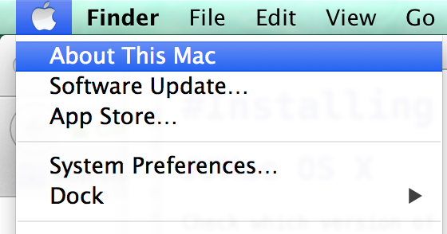
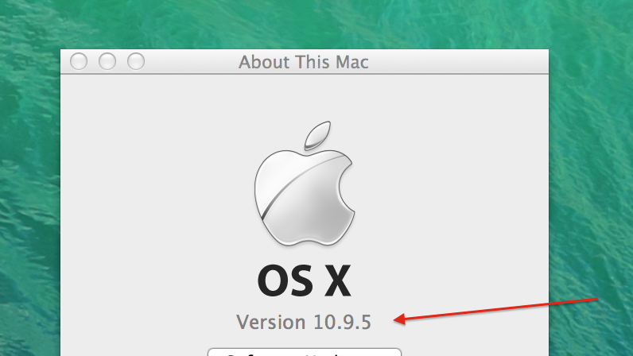

#Installing OpenFrameworks

##Mac OS X

Download the latest openFrameworks release for Xcode from [here.](http://openframeworks.cc/versions/v0.9.3/of_v0.9.3_osx_release.zip)

Check which version of Mac OS you have.

If you are are using version 10.10.5 or superior just follow the instructions [here.](http://openframeworks.cc/setup/xcode/)

If you have Mac OS X version less than 10.10.5 and newer or equal to 10.9.4 you should use xcode 6.2, which you can download from [here.](http://developer.apple.com/devcenter/download.action?path=/Developer_Tools/Xcode_6.2/Xcode_6.2.dmg)

If your Mac OS X version is less than 10.9.4 write me back and I'll let you know wich version to use.

Once downloaded install Xcode and follow the instructions [here.](http://openframeworks.cc/setup/xcode/)

##Windows

Download the latest openFrameworks release for Microsoft Visual Studio from [here.](http://openframeworks.cc/versions/v0.9.3/of_v0.9.3_vs_release.zip)

Download and install Microsoft Visual Studio Community 2015, by following the instructions provided [here.](http://openframeworks.cc/setup/vs/)

This works for windows 7, 8 & 10.

