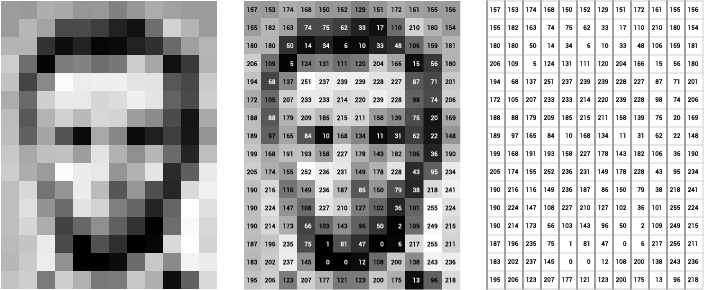

#Pixels

The pixel, short for **pic**ture **el**ement, is the smallest unit from which electronic images are made of. Each pixel contains information about a single color on a certain location on an image. There are modes for storing this color information. The most common modes are Grayscale (only grays, from black to white), RGB (Red, Green and Blue), RGBA (Red, Green, Blue and Alpha) or CMYK (Cyan, Magenta, Yellow and Black). Each of this values is stored as a number, and it is called a **channel.** Hence, Grayscale has 1 channel, RGB has 3 RGBA has 4 and CMYK has 4. The color information can be stored in any of these ways, but it will be needed to be transformed into RGB for electronic displays or CMYK for printing.

###Grayscale
The Grayscale pixel is the simplest one. I just has one channel and it only shows gray values, from black to white.

###RGB
In this mode the color information is stored as 3 different values (numbers), each corresponding to the amount of Red, Green and Blue needed to create the such color. Almost any color from the visible colors can be represented in this way.
This is the native mode that electronic displays use.
Electronic displays usually have pixels made of some material that can emit Red, Green and Blue colors independently on each pixel. Each of this elements will emit light with the intensity that its corresponding pixel channel has. When lights of different colors are mixed is called **additive** mix. 

Most displays have pixels made from 3 -Red, Green and Blue- stacked elements. 
These are so small that we cant see them so their light gets mixed and we see it as a single colored pixel.


###RGBA
This is like RGB with an extra channel, the A channel. The A channel in RGB**A** is the alpha value and represents the opacity of the color. Opacity is the oposite of transparency. This means if the alpha values is zero it will be absolutely transparent and if it is the maximum it will be completely opaque. All the available electronic displays can not become transparent so the alpha vaue can not be used directly on these. Instead the alpha channel is used to combine digital images, providing the ability of showing what is behind each pixel.


###CMYK

When printing channels are mixed in a different way than when using light as in electronic displays. These are mixed in a **Subtractive** way. To be able to represent almost any color, from white to black, different amounts of each channel must be put on the mix, each one substracting from the other one. You've probably have experienced this by mixing paints.

There are several ways for doing this and these depend on the printing technique, ink properties and several other factors, but mostly these rely on the optical mix, where our eyes will blend all the colors just because it's not capable of seeing each one separated from the other, or by actually mixing the inks.


While using openFrameworks, and mainly working with digital images, we will NOT use the CMYK color . I mention this because you might end up frequently seeing the CMYK color settings while using Photoshop or any graphics application, and it is a good thing to know what it means and its difference with RGB(A).


##Bits per pixel
As just described, a value (number) is used to describe each channel of a pixel.
In computers numbers can be represented using different amounts of bits, the more bits the more precision, but more space required to store it. 
####8 bits per channel
The most common is 8 bits per channel. This means that each channel can store an integer number from 0 to 255. So for RGB colors this gives more combinations than what our eyes can actually perceive. Computer displays have 8 bits per channel. In fact most cheap LCD displays use 6 bits and some weird kind of interpolation to display images. The total amount of bits used by a single RGB pixel are 24 bits and 32 for a RGBA pixel.
In computers 8 bits are also refered as 1 byte, so a single RGB pixel will use 3 bytes and a RGBA pixel 4 bytes.

#### So why more than 8 bits?
Even when our eyes can't see more colors than the ones represented by 8 bits per channel pixels, 8 bit numbers are not precise enough when performing operations on these, creating strange and sometimes anoying results that are visible.

In the following image, the same original image had blur effect performed, the left one at 8 bits per channel and the right one at 16 bits per channel.


Usualy you will only deal with 8 bit per channel images, but sometimes you will need to perform pixel operations as floating point numbers (32 bits) for getting the correct values. The type of object for storying 8 bit values is called ```unsigned char```.


##Storing pixels
All the pixels of an image are stored on a single array, starting from the top left one and moving to the right. If the end of a row is reached then the next row's leftmost pixel continues and the same process is repeated until all the pixels are reached.

####Single channel pixels


The following image shows a very small but scaled up Grayscale image at left, the same image with the value for each pixel overlayed and then at the right only the pixel values.



So the pixels for this image would be stored in an array like the following one:

```
{157, 153, 174, 168, 150, 152, 129, 151, 172, 161, 155, 156,
 155, 182, 163,  74,  75,  62,  33,  17, 110, 210, 180, 154,
 180, 180,  50,  14,  34,   6,  10,  33,  48, 106, 159, 181,
 206, 109,   5, 124, 131, 111, 120, 204, 166,  15,  56, 180,
 194,  68, 137, 251, 237, 239, 239, 228, 227,  87,  71, 201,
 172, 105, 207, 233, 233, 214, 220, 239, 228,  98,  74, 206,
 188,  88, 179, 209, 185, 215, 211, 158, 139,  75,  20, 169,
 189,  97, 165,  84,  10, 168, 134,  11,  31,  62,  22, 148,
 199, 168, 191, 193, 158, 227, 178, 143, 182, 106,  36, 190,
 205, 174, 155, 252, 236, 231, 149, 178, 228,  43,  95, 234,
 190, 216, 116, 149, 236, 187,  86, 150,  79,  38, 218, 241,
 190, 224, 147, 108, 227, 210, 127, 102,  36, 101, 255, 224,
 190, 214, 173,  66, 103, 143,  96,  50,   2, 109, 249, 215,
 187, 196, 235,  75,   1,  81,  47,   0,   6, 217, 255, 211,
 183, 202, 237, 145,   0,   0,  12, 108, 200, 138, 243, 236,
 195, 206, 123, 207, 177, 121, 123, 200, 175,  13,  96, 218};
```
Take into account that each line here is just because a new line was added to the text just to make it more tidy but it is all just a single array.

####Multi Channel pixels
When we have more than one channel per pixel, each pixel is stored in the same way as grayscale images but instead of adding just one value to the array we add to it the values for each channel.


##CPU and GPU
Before continuing with pixels lets take a short tour on the GPU and CPU relationship.
The CPU -Central Processing Unit- which is the main processor of your computer is the one that executes your code. Whenever your code creates a new object, for example int, float, vector<float>, ofImage, or any other, it will use some memory space of the RAM memory. When you load an image from your hard drive, your ofApp will open it, decode its data and place the pixel data into the RAM memory.

The GPU -Graphics Processing Unit- is an extra processor that your computer has and its only job is to control your display and put on it images, text, shapes, and colors. The GPU also has some memory, usually a lot less than what the CPU has, but this memory is only for storing the images and geometry data that it should display. Images (pixels) in the GPU are called **textures**. So, for your computer to display any image it must first hand it to the GPU which will store it as a texture.

So, once the CPU loaded an image file into the RAM memory it has to give those pixels to the GPU. This is done using openGL, which is a code library that enables communication between the CPU and the GPU. Hence, your CPU will pass the pixels it has using openGL to the GPU, which will then draw it to the screen.


		

##Using pixels in openFramewoks

###ofPixels
This class belongs to openFrameworks. It stores 8 bit per channel pixels and provides functions for easily accessing the pixel values and to perform several operations over the these like resize, crop and rotate, among others. The data type it will use is an ```unsigned char``` (8 bit number, from 0 to 255) to store pixel values.

For storing pixels with a different data type the following exist:

`ofShortPixels` that will store 16 bits per channel pixels. The data type is an `unsigned short` which can have integer values from 0 to 65535.
`ofFloatPixels` will use `float`numbers which are 32 bit, to store the pixel values.

All the pixel data that an ofPixel object holds is stored in the CPU's RAM memory.


###ofTexture
This is also an openFrameworks class. It allows the allocation of textures in the GPU, upload pixel data to it and drawing it into screen. All this is done internaly by openFrameworks using openGL so you don't have to worry about it.


###ofImage
The ofImage class contains an ofPixels and an ofTexture objects. This allows you to load and save images, perform operations over its pixels and draw it into screen.


When ever you modify your image pixels you are modifying the pixel data in the CPU memory, so in order to draw this on screen you need to pass this modified pixels to the texture in the cpu. This is not done automatically. For doing such you need to call the ```update()``` function on your ofImage object. This is not automatic because passing data between the CPU and GPU is slow, so it must be avoided as much as possible.


